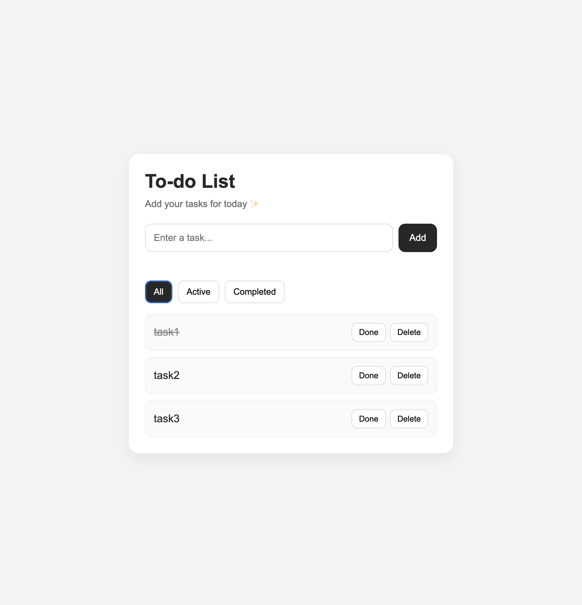
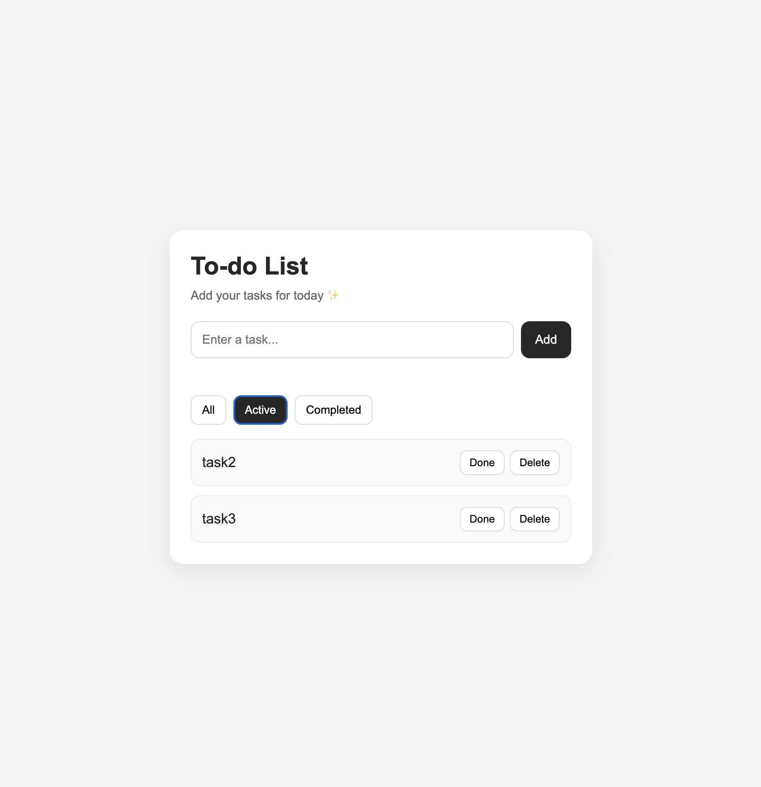
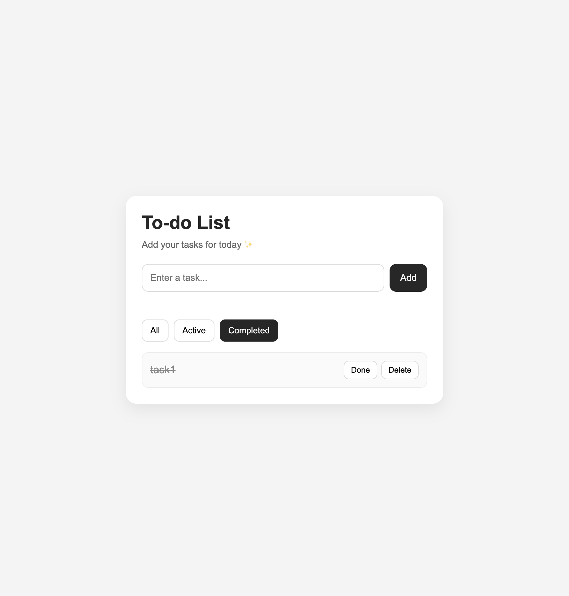

# Todo List App

A simple Todo List web application built with **HTML, CSS, and Vanilla JavaScript**.  
Users can add tasks, mark them as completed, delete them, and filter tasks by status.  
Todo data is stored in **localStorage**, so tasks remain even after refreshing the page.

## Live Demo

[View the live project](https://yoonahjoo.github.io/todo-list-app/)

---

## Screenshots

### Main View

### Active Tasks Filter

### Completed Tasks Filter

## Features

- Add new tasks
- Mark tasks as completed
- Delete tasks
- Persist tasks using **localStorage**
- Filter tasks by status:
  - All
  - Active
  - Completed

---

## Tech Stack

- HTML
- CSS
- JavaScript (Vanilla JS)
- Browser localStorage

---

## File Structure

- `index.html` : Page structure and layout
- `style.css` : Styling and UI design
- `script.js` : Application logic and DOM manipulation

---

## How to Run

1. Open the project folder.
2. Open the `index.html` file in your browser.

---

## What I Learned

- How to manage a dynamic task list with JavaScript
- How to update the UI through DOM manipulation
- How to store and retrieve task data using localStorage
- How to implement task filtering based on completion status

## Future Improvements

- Add task editing functionality
- Add due dates and priority options
- Improve mobile responsiveness
- Add dark mode

---

## Author

**Yoonah Joo**
